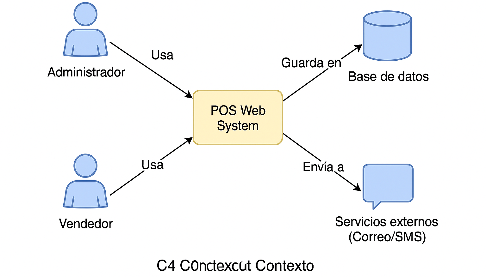
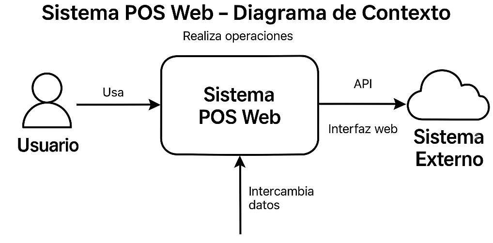

---

# **DOCUMENTACIÓN ARQUITECTÓNICA - SISTEMA POS WEB**

## **Modelo C4 - Nivel 1: Diagrama de Contexto**

### Descripción General

El Sistema POS Web permite a los administradores gestionar el ecosistema de un minimercado (clientes, productos, ventas, proveedores y usuarios). Los vendedores pueden registrar ventas y gestionar clientes. El sistema almacena toda la información en una base de datos MySQL y está previsto para integrarse con servicios de correo y SMS para promociones.

### Actores y Sistemas Relacionados

* **Administrador**: Gestiona clientes, productos, proveedores, ventas y usuarios.
* **Vendedor**: Gestiona clientes y registra ventas.
* **Sistema POS Web**: Aplicación principal que centraliza la operación del minimercado.
* **Base de Datos MySQL**: Almacena toda la información de forma estructurada.
* **Plataforma de Correos/SMS (futura)**: Sistema externo para promociones.

### Diagrama Visual

---

## **Modelo C4 - Nivel 2: Diagrama de Contenedores**

### **Descripción General**

El sistema POS Web se compone de los siguientes contenedores lógicos:

### **Contenedores**

| Contenedor       | Tecnología                    | Descripción                                                                     |
| ---------------- | ----------------------------- | ------------------------------------------------------------------------------- |
| Frontend Web     | React o Angular *(pendiente)* | Interfaz para que los usuarios (admin y vendedores) interactúen con el sistema. |
| Backend REST API | Java 17 + Spring Boot         | Maneja la lógica del negocio, expone servicios REST y aplica seguridad.         |
| Base de Datos    | MySQL                         | Guarda información sobre ventas, productos, clientes, usuarios y roles.         |
| Stack de Logging | Promtail + Loki + Grafana     | Permite trazabilidad y monitoreo de logs.                                       |

### **Detalles del Backend**

* Arquitectura Hexagonal (puertos y adaptadores).
* Uso de Spring Boot, JPA, MapStruct, Swagger.
* Preparado para integración con servicios externos.
* Pendiente: seguridad con roles, autenticación/autorización (Spring Security + JWT).

### **Diagrama Visual**

## **Observaciones**

* El frontend se desarrollará al final del proyecto.
* Esta documentación cumple con los requerimientos solicitados por el docente en el caso de estudio.
* Se recomienda actualizar estos diagramas al finalizar el backend para reflejar cambios estructurales.
